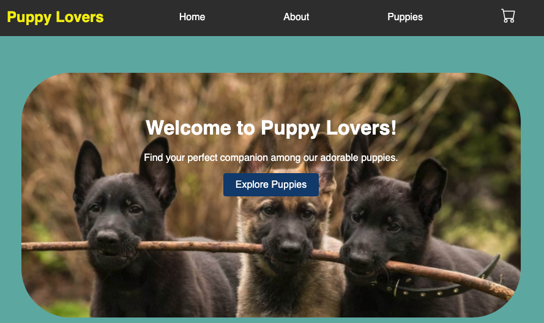

# Youse_Tiffany_PuppyApp_Capstone

<a name="readme-top"></a>

<!-- PROJECT SHIELDS -->

[![Contributors][contributors-shield]][contributors-url]
[![Forks][forks-shield]][forks-url]
[![Stargazers][stars-shield]][stars-url]
[![LinkedIn][linkedin-shield]][linkedin-url]


<!-- PROJECT LOGO -->
<br />
<div align="center">
  <a href="https://github.com/tyouse11">
    
  </a>

  <h3 align="center"></h3>

  <p align="center">
    Link to backend of project
    <br />
    <a href="https://github.com/tyouse11/cap_backend"><strong>Explore the backend »</strong></a>
    <br />
  </p>
</div>


<!-- TABLE OF CONTENTS -->
<details>
  <ol>
    <li>
      <a href="#about-the-project">About The Project</a>
      <ul>
        <li><a href="#built-with">Built With</a></li>
      </ul>
    </li>
    <li>
      <a href="#getting-started">Getting Started</a>
      <ul>
        <li><a href="#prerequisites">Prerequisites</a></li>
        <li><a href="#installation">Installation</a></li>
      </ul>
    </li>
    <li><a href="#contributing">Contributing</a></li>
    <li><a href="#contact">Contact</a></li>
    <li><a href="#acknowledgments">Acknowledgments</a></li>
  </ol>
</details>


<!-- ABOUT THE PROJECT -->
### About This project 

This projects acts as a store that sells puppies.

This project is a full-stack web application using MongoDB, Express, React, and Node (MERN) with the following requirements:

Your project folder should be named as follows, for submission:
LastName_FirstName_ProjectName_Capstone

(20%) Project Structure, Standardization, and Convention:
- Project is organized into appropriate files and directories, following best practices
- Project contains an appropriate level of comments
- Project is pushed to GitHub, and contains a README file that documents the project, including an overall description of the project
- Standard naming conventions are used throughout the project
- Ensure that the program runs without errors
- Level of effort displayed in creativity, presentation, and user experience

(12%) Core JavaScript
- Demonstrate proper usage of ES6 syntax and tools
- Use functions and classes to adhere to the DRY principle
- Use Promises and async/await, where appropriate
- Use Axios or fetch to retrieve data from an API
- Use sound programming logic throughout the application
- Use appropriate exception handling

(9%) Database
- Use MongoDB to create a database for your application
- Apply appropriate indexes to your database collections
- Create reasonable schemas for your data by following data modeling best practices

(19%) Server
- Create a RESTful API using Node and Express.
- Include API routes for all four CRUD operations
- Utilize the native MongoDB driver or Mongoose to interface with your database
- Include at least one form of user authentication/authorization within the application

(35%) Front-End Development
- Use React to create the application’s front-end
- Use CSS to style the application
- Create at least four different views or pages for the application
- Create some form of navigation that is included across the application’s pages, utilizing React Router for page rendering
- Use React Hooks or Redux for application state management
- Interface directly with the server and API that you created


<p align="right">(<a href="#readme-top">back to top</a>)</p>


### Built With

* [![React][React.js]][React-url]
* [![Bootstrap][Bootstrap.com]][Bootstrap-url]

<p align="right">(<a href="#readme-top">back to top</a>)</p>


<!-- GETTING STARTED -->
## Getting Started

### Prerequisites

* npm
  ```sh
  npm install npm@latest -g
  ```

### Installation

1. Clone the repo
   ```sh
   git clone https://github.com/tyouse11/cap_frontend.git
   git clone https://github.com/tyouse11/cap_backend.git
   ```
2. Install NPM packages
   ```sh
   npm install
   npm install axios
   npm install express mongodb mongoose dotenv axios cors
   npm install react-router-dom
   ```


<p align="right">(<a href="#readme-top">back to top</a>)</p>


<!-- CONTRIBUTING -->
## Contributing

Contributions are what make the open source community such an amazing place to learn, inspire, and create. Any contributions you make are **greatly appreciated**.

If you have a suggestion that would make this better, please fork the repo and create a pull request. You can also simply open an issue with the tag "enhancement".
Don't forget to give the project a star! Thanks again!

1. Fork the Project
2. Create your Feature Branch (`git checkout -b feature/AmazingFeature`)
3. Commit your Changes (`git commit -m 'Add some AmazingFeature'`)
4. Push to the Branch (`git push origin feature/AmazingFeature`)
5. Open a Pull Request

<p align="right">(<a href="#readme-top">back to top</a>)</p>


<!-- CONTACT -->
## Contact

Tiffany Youse - tyouse1@live.com

Project Link: [https://github.com/tyouse11/cap_frontend](https://github.com/tyouse11/cap_backend)

<p align="right">(<a href="#readme-top">back to top</a>)</p>


<!-- ACKNOWLEDGMENTS -->
## Acknowledgments

Use this space to list resources you find helpful and would like to give credit to. I've included a few of my favorites to kick things off!

* [Img Shields](https://shields.io)
* [GitHub Pages](https://pages.github.com)
* [React Icons](https://react-icons.github.io/react-icons/search)

<p align="right">(<a href="#readme-top">back to top</a>)</p>


<!-- MARKDOWN LINKS & IMAGES -->
<!-- https://www.markdownguide.org/basic-syntax/#reference-style-links -->
[contributors-shield]: https://img.shields.io/github/contributors/tyouse11/cap_frontend.svg?style=for-the-badge
[contributors-url]: https://github.com/tyouse11/cap_frontend/graphs/contributors
[forks-shield]: https://img.shields.io/github/forks/tyouse11/cap_frontend.svg?style=for-the-badge
[forks-url]: https://github.com/tyouse11/cap_frontend/network/members
[stars-shield]: https://img.shields.io/github/stars/tyouse11/cap_frontend.svg?style=for-the-badge
[stars-url]: https://github.com/tyouse11/cap_frontend/stargazers
[linkedin-shield]: https://img.shields.io/badge/-LinkedIn-black.svg?style=for-the-badge&logo=linkedin&colorB=555
[linkedin-url]: https://www.linkedin.com/in/tiffany-youse/
[product-screenshot]: images/screenshot.png
[React.js]: https://img.shields.io/badge/React-20232A?style=for-the-badge&logo=react&logoColor=61DAFB
[React-url]: https://reactjs.org/
[Bootstrap.com]: https://img.shields.io/badge/Bootstrap-563D7C?style=for-the-badge&logo=bootstrap&logoColor=white
[Bootstrap-url]: https://getbootstrap.com
